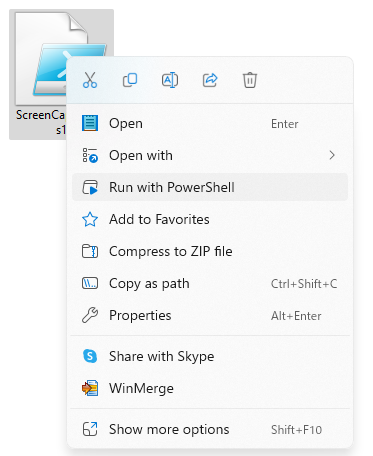

# ScreenCaptureScript
This is just a screen capture script made for use in environments where you do not have installation privileges; you can use it without installing anything as long as you have Windows PowerShell. Parameters are provided to support multiple displays and high DPI displays.

Just right-click and run as PowerShell, and it will keep taking full-screen captures in the same folder.

